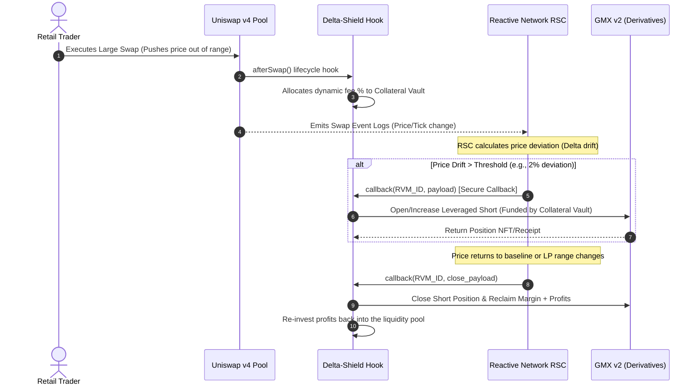

# Reactive Delta-Shield (RDS)
**Autonomous, Self-Funding LP Delta-Hedging Engine for Uniswap v4**

Reactive Delta-Shield is a Uniswap v4 hook that integrates the **Reactive Network** to offer automated, zero-maintenance, and self-funding downside protection for concentrated liquidity providers (LPs). 

This project was built to address **Impermanent Loss (IL)** and **Loss-Versus-Rebalancing (LVR)** natively within Uniswap v4 pools.

---

## Key Features

1. **Self-Funding Premium**: Instead of LPs manually managing collateral and funding rate payments for hedges, the hook dynamically isolates a fraction of pool swap fees (e.g., 10%) into a **Collateral Vault** to fund a short perp position.
2. **Autonomous Reactive Triggers**: By running on the **Reactive Network**, a **Reactive Smart Contract (RSC)** monitors the pool's price fluctuations in real-time. If price movement exceeds a predefined safety threshold (Delta drift), the RSC automatically calls the Hook to open a hedge.
3. **Multi-Protocol Integration**: The hook executes leveraged short/long positions on a derivatives exchange (e.g., GMX or Synthetix) to offset the LP's delta exposure.

---

## File Structure

```text
├── src/
│   ├── ReactiveDeltaShieldHook.sol   # Uniswap v4 Hook (handles fee allocation & GMX integration)
│   └── DeltaShieldRSC.sol             # Reactive Smart Contract (monitors volatility & executes callbacks)
├── test/
│   ├── ReactiveDeltaShieldHook.t.sol # Unit tests simulating swaps, volatility, and callbacks
│   └── utils/
│       ├── MockPerpDex.sol           # Mock Perpetual Exchange for testing margin and positions
│       └── BaseTest.sol              # Uniswap v4 testing utilities (cloned from template)
└── foundry.toml
```

---

## Architecture Flow



---


## Governance & Safety Controls

The `ReactiveDeltaShieldHook` features a set of robust safety controls and governance settings to manage the hedging configuration dynamically:
- **Ownership**: The contract designates an `owner` who is authorized to adjust key configurations and update target addresses.
- **Pausability**: In the event of a market anomaly or smart contract emergency, the owner can pause the hook. When paused, the hook will skip swap fee accumulation and reject new hedging triggers.
- **Updatable Configurations**:
  - `updateReactiveVmAddress`: Update the authorized Reactive VM sender.
  - `updatePerpDexAddress` & `updateMarginVaultAddress`: Migrate to a new derivatives platform or vault.
  - `setHedgeFeeFraction`: Fine-tune the percentage of swap fees allocated to hedging.
  - `setLeverage`: Dynamically adjust perpetual contract leverage bounds (1x - 100x).

## Getting Started

### 1. Requirements
Ensure you have Foundry installed on your machine. If not, install it via:
```bash
curl -L https://foundry.paradigm.xyz | bash
foundryup
```

### 2. Setup
Install project submodules and Uniswap v4 core files:
```bash
forge install
```

### 3. Run Tests
Verify the hook logic and mock execution works:
```bash
forge test
```

---

## Deployment & Production Workflow

### Step 1: Deploy Uniswap v4 Hook
Deploy `ReactiveDeltaShieldHook.sol` to your chosen EVM-compatible chain (e.g., Arbitrum, Base, or Unichain). Note the deployed address.

### Step 2: Deploy Reactive Contract (RSC)
Deploy `DeltaShieldRSC.sol` to the **Reactive Network Testnet / Kopru** using the Reactive Network developer tools. Provide:
* Source Chain ID
* Target Chain ID (where Uniswap v4 pool resides)
* Target Uniswap v4 Pool Address
* Target Hook Address

Once deployed, the RSC will automatically subscribe to the Swap logs and orchestrate autonomous hedging transactions.
